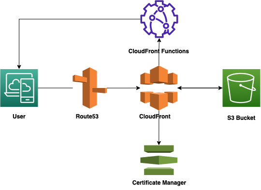

# hugo-personal-website

This repository contains my personal website, which is built using [Hugo](https://gohugo.io/). The theme is [hugo-coder](https://hugo-coder.netlify.app/) and the website is hosted on [AWS](https://www.aws.amazon.com/). The website is available at [fatihkoc.net](https://fatihkoc.net).

I created this project for [Cloud Resume Challange](https://cloudresumechallenge.dev/). My website was down for a few years and I was planning to fix it but it never happened. I decided to use this challenge as an opportunity to fix it. I also wanted to learn more about AWS and I thought this would be a good opportunity to do so. 

## Technologies:

- Hugo: Static site generator
- S3: Static website hosting, Terraform state storage
- CloudFront: CDN
- Route53: DNS
- Certificate Manager: SSL certificate
- Terraform: Infrastructure as Code
- DynamoDB: Terraform state locking
- GitHub Actions: CI/CD
- Cypress: E2E testing

## Diagram

<p align="center">
    
p>

## How to run locally

```bash
# Clone the repository
git clone https://github.com/fatihkc/hugo-personal-website.git

# Install dependencies
brew install hugo
# or
port install hugo

# Run the website
hugo server

# Open the website
open http://localhost:1313
```

## Infrastructure

```bash
# Install Terraform
brew tap hashicorp/tap
brew install hashicorp/tap/terraform

# Change backend configuration in terraform/backend.tf

vi terraform/backend.tf

# Change variables in terraform/variables.tf
vi terraform/variables.tf

# Initialize Terraform
terraform init

# Create a plan
terraform plan

# Apply the plan
terraform apply

# Open the website
open $website_url
```

## CI/CD

CI/CD is done using GitHub Actions. The site workflow is defined in `.github/workflows/site.yml`. The workflow is triggered when a new commit is pushed to the `main` branch. The workflow does the following:

- Checkout the repository
- Setup Hugo
- Build the website
- Deploy the website to S3
- Test the website using Cypress

The terraform workflow is defined in `.github/workflows/terraform.yml`. The workflow is triggered manually. I don't want to use it for every new commit. The workflow does the following:

- Checkout the repository
- Setup Terraform
- Initialize Terraform
- Format Terraform
- Plan Terraform
- Apply Terraform

## Blog post for Cloud Resume Challenge

- [Cloud Resume Challenge](https://fatihkoc.net/posts/cloud-resume-challenge/)

## License

[MIT](https://choosealicense.com/licenses/mit/)

Steps for first blog post:

- Build website
- Create IAM user
- aws configure
- Create S3 bucket for state
- Create DynamoDB table for state
- Write Terraform script for s3 bucket, acm, cloudfront, route53
- Import Route53 if exists
- Write site deployment to config.toml
- GitHub Actions for site and terraform
- Cloudfront functions for redirect
- Smoke test
- Write your first blog post